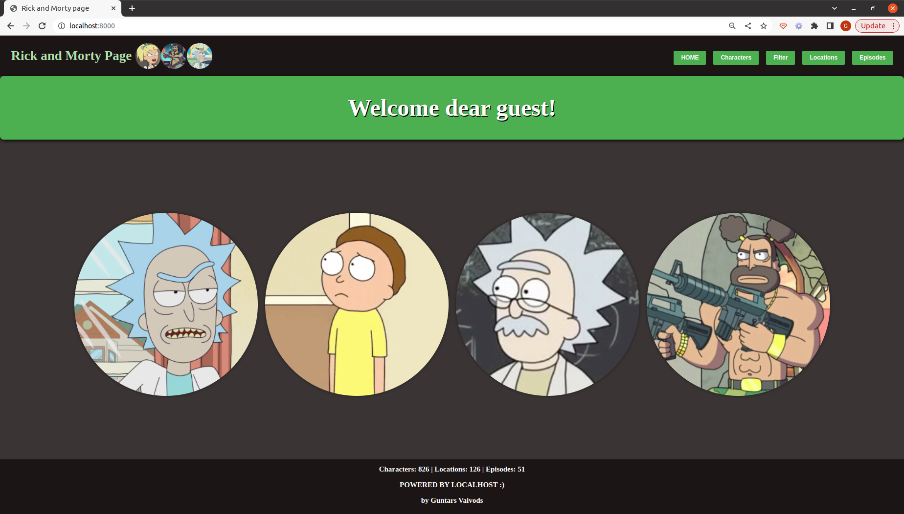
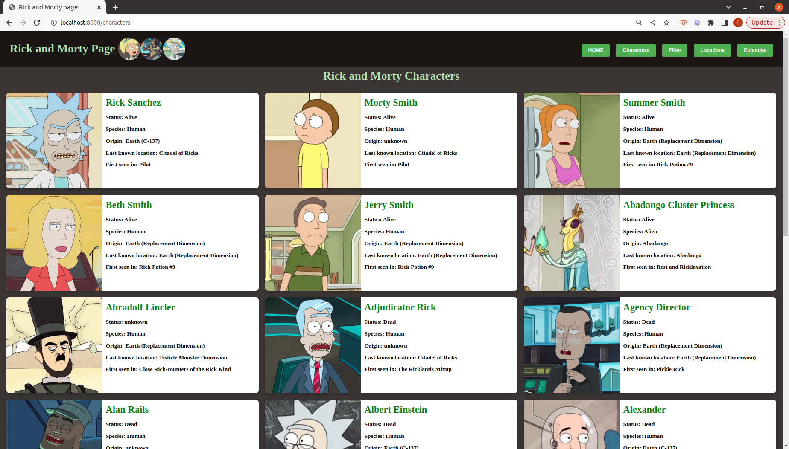
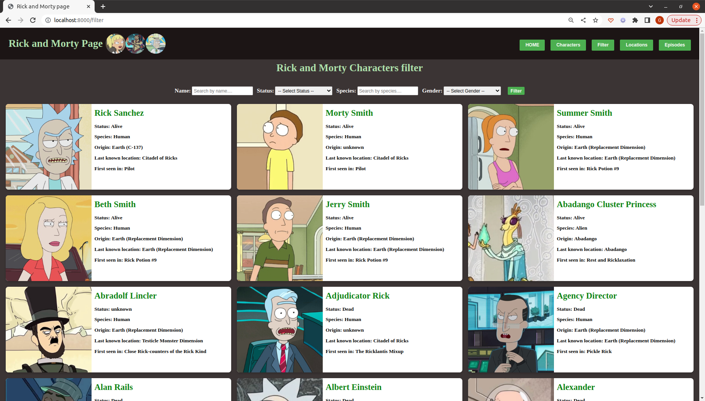
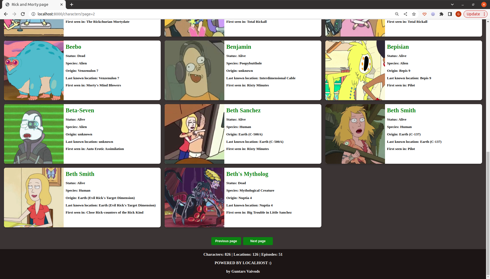

An application that displays information about characters from the popular TV show "Rick and Morty." It utilizes PHP and the Rick and Morty API to fetch and display/filter character data. The user interface is powered by Twig, while the styling is implemented using CSS. Here are the instructions how to open project:

| Step | Description                                      |
|------|--------------------------------------------------|
| 1    | Clone repo                                       |
| 2    | Install composer                                 |
| 3    | run php -S localhost:8000 from /public directory |

Webpage screenshots:

